# RxGuard · SyntheticMass Engineering Audit

[](https://github.com/ahmedalaqab33-source/rxguard-syntheticmass-engineering/actions/workflows/tests.yml)


**Large-scale data engineering with an explicit clinical feasibility stop.**

RxGuard explores reproducible medication-safety research infrastructure. This repository preserves its completed SyntheticMass engineering phase: CSV ingestion, Parquet/DuckDB analytics, patient identifier reconciliation, and a renal-data feasibility kill-test. It packages existing work and evidence; it is not a new analysis presented as an earlier result.

**SyntheticMass did not support clinical validation of AKI, vancomycin nephrotoxicity, or clinical performance.** All 1,913,439 tested creatinine measurements were 1.0 mg/dL; none of the 361,193 patients with multiple measurements showed variation. The medication-description search returned zero vancomycin matches. The project therefore retained SyntheticMass for engineering/product validation and pivoted its clinical-validation pathway to MIMIC-IV. MIMIC-IV validation is not included in this release.

## Evidence at a glance

| Measure | Result | Evidence and interpretation |
| --- | ---: | --- |
| CSV batches / files | 12 / 108 | Historical ingestion manifest |
| Patient rows, original ingestion | 1,595,050 | Original manifest and preserved pre-repair Parquet |
| Patient rows, repaired table | 1,594,711 | Current Parquet and independent verification; **339 fewer rows** |
| Encounter rows | 15,109,427 | Current Parquet; matches historical manifest |
| Medication rows | 4,781,956 | Current Parquet; matches historical manifest |
| Observation rows | 64,654,706 | Current Parquet; matches historical manifest |
| Creatinine observations | 1,913,439 | Description substring search; all numeric, all 1.0 |
| Canonical identifiers | 1,595,720 | Unique, nonempty union of patient and event identifiers |
| Conflicting demographic identities | 43 | Retained in registry; demographic use held |
| Registry IDs lacking a patient row | 1,854 | Retained without demographic imputation |
| Original CSV → Parquet size | 14.822 → 1.702 GiB | 8.71× historical size ratio, before patient repair |

The original reports called binary units “GB”; this repository uses **GiB** for the same measurements. Current active Parquet is 1,801,835,388 bytes, excluding the pre-repair backup. The 339-row patient discrepancy and remaining malformed demographic fields are documented, not silently corrected. The registry's `DEMOGRAPHICS_ELIGIBLE` flag is an identity-conflict gate, **not a certification of demographic accuracy**.

See [current verification](results/qc/local_verification.json), [historical ingestion evidence](results/summaries/ingestion_manifest.json), [registry evidence](results/summaries/registry.json), [kill-test evidence](results/summaries/kill_test.json), and [engineering audit](docs/engineering_audit.md).

## Pipeline and quality gates

```mermaid
flowchart LR
  A[Local SyntheticMass CSV batches] --> B[Bronze: VARCHAR Parquet / ZSTD]
  B --> C[Explicit patient CSV repair]
  C --> D[DuckDB views and canonical registry]
  D --> E[Linkage and conflict restrictions]
  E --> F[Creatinine distribution and longitudinal kill-test]
  F --> G[Engineering-only SyntheticMass decision]
  G --> H[Separate MIMIC-IV validation pathway]
```



Bronze conversion stores source fields as strings to avoid premature type inference; union-by-name views combine batches. A later patient parser repair restored a usable identifier column but did not resolve all schema defects. The canonical registry unions nonempty identifiers across patients, encounters, and observations. It retains orphan event identifiers, flags conflicting demographic records, and never invents missing demographics. Creatinine selection and medication discovery preserve the original case-insensitive description searches.

This demonstrates scale handling, joins, columnar storage, integrity checks, and a responsible decision to stop an unsuitable clinical experiment. It does not establish the correctness of every source field, end-to-end raw-data equivalence, or clinical validity.

## Quick start: tests without the dataset

Requires Python 3.11 or later. The local acceptance run used Python 3.14.7 and DuckDB 1.5.5. Only DuckDB is needed at runtime.

```sh
python -m venv .venv
# Linux/macOS: source .venv/bin/activate
# Windows PowerShell: .\.venv\Scripts\Activate.ps1
python -m pip install -e .
python -m unittest discover -s tests -v
python scripts/audit_release.py
```

Tests generate tiny, invented fixtures in temporary directories. They exercise the actual ingestion, repair, registry, and kill-test stages; they are software tests, not clinical evidence.

## Reproduce with local data

Use a **new output directory outside the source directory**. The CLI refuses an existing output directory and leaves partial failed runs intact for inspection. Inputs remain unchanged.

Recompute the registry and kill-test from existing active Parquet:

```sh
rxguard-audit --parquet-root /path/to/RxGuard_Analytics/parquet --work .local/reproduction-01
```

Rebuild from appropriately obtained local CSV batches:

```sh
rxguard-audit --csv-root /path/to/RxGuard_CSV_Batches --work .local/rebuild-01
```

The second route executes original ingestion → patient repair → registry → kill-test. It requires additional disk space for Parquet, the pre-repair patient backup, database, and private patient-level outputs. No data download occurs automatically. The full CSV rebuild was exercised on fixtures; existing full-scale conversion was verified through metadata and selective queries instead of being rerun unnecessarily. The full-scale Parquet route was rerun successfully.

Full logs, databases, and generated patient-level outputs remain local. Never publish the run directory. See [reproduction instructions](docs/reproducibility.md), [environment](environment/README.md), and [data provenance](docs/data_provenance.md).

## Repository map

```text
src/rxguard/       CLI and minimally adapted original analytical stages
legacy/           Original scripts and decoded kill-test for provenance; do not run directly
tests/            Invented fixture and preservation tests
scripts/          Publication safety and verification utilities
results/summaries Reviewed historical aggregate evidence
results/qc/       Fresh verification and acceptance evidence
docs/             Architecture, provenance, scientific scope, audit, limitations, portfolio
environment/      Actual runtime requirements and observed environment
.github/workflows Software checks; no source dataset required
```

## Scope, limitations, and next research phase

The kill-test assesses data heterogeneity, not AKI. A positive fixture result means only “eligible for further phenotype testing.” Historical `qa_gate: FAIL` remains in the evidence. The registry mitigates identifier coverage problems; it does not repair malformed demographics or resolve the patient-row discrepancy. Historical count-query timings are local observations, often aided by Parquet metadata, not general performance promises.

MIMIC-IV is the designated next clinical-validation environment, requiring a separately governed protocol, phenotype and exposure definitions, temporal data-quality checks, and clinical evaluation. No MIMIC-IV data or performance results are distributed here. See [scientific scope](docs/scientific_scope.md) and [limitations](docs/limitations.md).

## Data availability, citation, and license

The repository distributes code, documentation, and reviewed aggregate summaries only. Raw CSV/FHIR, patient extracts, Parquet, DuckDB files, credentials, unrelated personal documents, and private run logs are excluded. Obtain SyntheticMass independently from the [Synthea downloads page](https://synthetichealth.github.io/downloads.html); the exact original download transaction was not recovered.

Cite this software using [CITATION.cff](CITATION.cff), including the release tag and commit used. No DOI or peer-reviewed publication is claimed. Code is released under the [MIT License](LICENSE); upstream datasets and dependencies retain their own terms.
